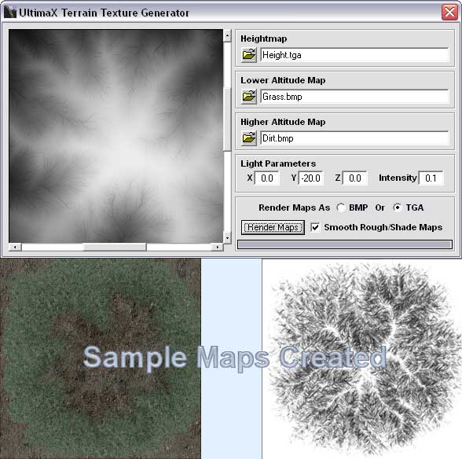



## UltimaX Terrain Texture Generator

### Description

This will take a height map, lower altitude map, and a higher altitude map and blend them. It will output a rough map thats used for CLOD terrain engine, a shade map, a blend map, and a shaded blend map. For more information read the readme.txt. If you have any questions, feel free to ask. Enjoy this :)
 
### More Info
 

             |
---                |---
**Submitted On**   |2003-09-01 13:24:56
**By**             |[James Dougherty](https://github.com/Planet-Source-Code/PSCIndex/blob/master/ByAuthor/james-dougherty.md)
**Level**          |Advanced
**User Rating**    |5.0 (10 globes from 2 users)
**Compatibility**  |VB 6\.0
**Category**       |[Graphics](https://github.com/Planet-Source-Code/PSCIndex/blob/master/ByCategory/graphics__1-46.md)
**World**          |[Visual Basic](https://github.com/Planet-Source-Code/PSCIndex/blob/master/ByWorld/visual-basic.md)
**Archive File**   |[UltimaX\_Te163912912003\.zip](https://github.com/Planet-Source-Code/james-dougherty-ultimax-terrain-texture-generator__1-48152/archive/master.zip)

